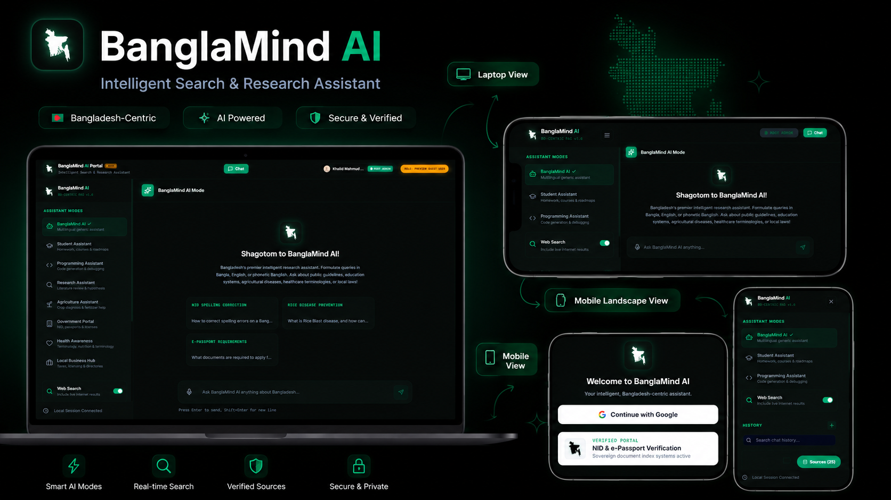
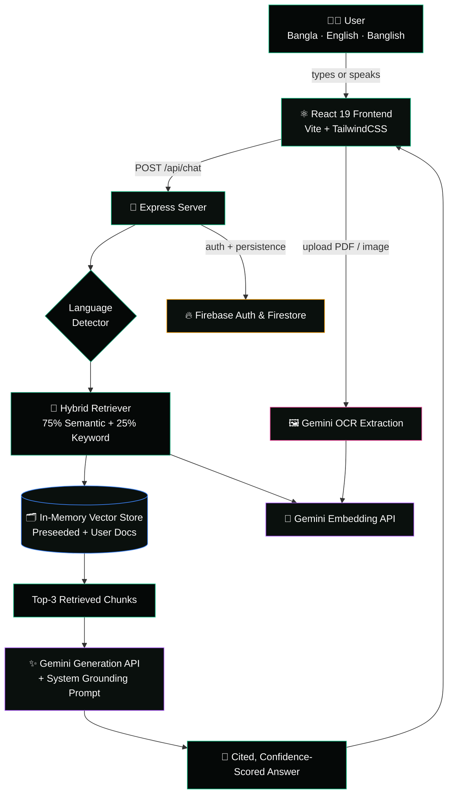
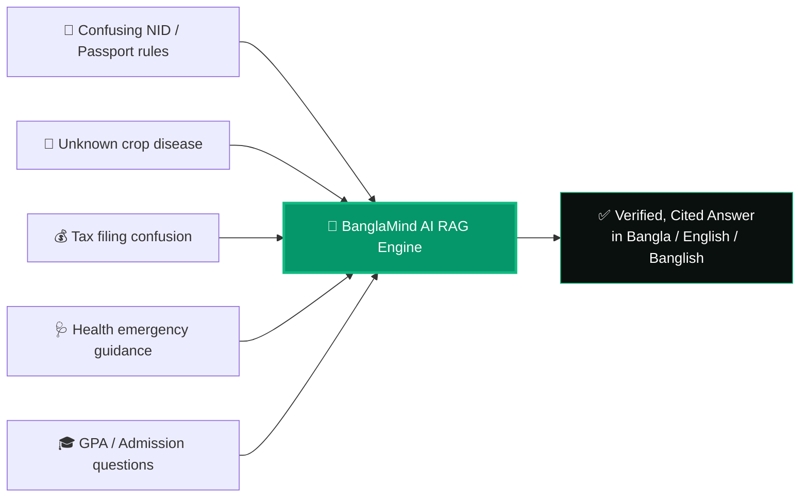

<div align="center">


<br/>


<br/><br/>

[](https://banglamind-ai.onrender.com/)


<br/><br/>

<a href="#-the-problem--the-solution">Problem &amp; Solution</a> •
<a href="#-live-demo--preview">Preview</a> •
<a href="#-features">Features</a> •
<a href="#-architecture">Architecture</a> •
<a href="#-tech-stack">Tech Stack</a> •
<a href="#-getting-started">Getting Started</a> •
<a href="#-developer">Developer</a>

</div>

<br/>

<div align="center">

</div>

---

## 🇧🇩 The Problem &amp; The Solution

Millions of Bangladeshi citizens — students, farmers, small business owners, and everyday people — lose time, money, and peace of mind navigating **fragmented, scattered, and confusing government + civic information**:

| 😣 The Problem | ✅ How BanglaMind AI Solves It |
|---|---|
| NID correction, e-Passport rules, and land mutation steps are spread across dozens of government sites in dense bureaucratic language | Instantly explains procedures, required documents, and fees in **plain Bangla, English, or Banglish** |
| Farmers can't quickly diagnose crop diseases (like Rice Blast or Fall Armyworm) or find loan eligibility rules | Dedicated **Agriculture Assistant** mode with verified DAE/Bangladesh Bank guidance |
| Students struggle to find accurate SSC/HSC GPA formulas, BCS exam structure, or scholarship info | **Student Assistant** mode trained on verified academic knowledge sources |
| Small business owners don't know Trade License or NBR tax filing steps | **Business Hub** mode covers licensing, TIN registration &amp; tax slabs |
| People don't know dengue danger signs, platelet thresholds, or Surokkha vaccine registration | **Health Assistant** mode surfaces verified public-health guidance instantly |
| Most AI tools don't understand **Banglish** (code-mixed Bangla-English) the way Bangladeshis actually type | Native language detection for **Bangla, English &amp; Banglish** — responds in the same register |
| AI answers are often hallucinated with no way to verify them | Every answer is backed by **Retrieval-Augmented Generation (RAG)** with visible **source citations** and a confidence score |

> **In short:** BanglaMind AI is a Bangladesh-centric, multilingual, citation-backed AI assistant that turns confusing bureaucratic and civic knowledge into clear, trustworthy, instant answers — in the language people actually speak.

---

## 🖼️ Live Demo &amp; Preview

<div align="center">

</div>

<div align="center">
<sub>Dark, glassmorphic UI • Bangla/English/Banglish chat • RAG semantic inspector • Admin analytics dashboard</sub>
</div>

---

## ✨ Features

<table>
<tr>
<td width="33%" valign="top">

### 🧠 Intelligent RAG Core
- Hybrid **semantic + keyword** search
- Gemini-powered embeddings
- Confidence scoring per answer
- Inline **source citations**
- Anti-hallucination guardrails

</td>
<td width="33%" valign="top">

### 🗣️ True Multilingual UX
- Auto-detects **Bangla / English / Banglish**
- Voice input (Speech-to-Text)
- Text-to-Speech playback
- Responds in the user's own language register

</td>
<td width="33%" valign="top">

### 🧩 8 Specialized Modes
- 🎓 Student &nbsp; 💻 Programming
- 🔬 Research &nbsp; 🌱 Agriculture
- 🏛️ Government &nbsp; ❤️ Health
- 💼 Business &nbsp; 🤖 General

</td>
</tr>
<tr>
<td width="33%" valign="top">

### 📚 Living Knowledge Base
- 25+ preseeded verified civic documents
- Drag &amp; drop **PDF / image OCR** ingestion
- Auto-chunking &amp; vector indexing
- Per-document retrieval toggling

</td>
<td width="33%" valign="top">

### 📊 Admin Analytics Console
- BLEU / ROUGE-L / BERTScore panels
- Live latency &amp; token telemetry
- Per-user session auditing
- System activity log stream

</td>
<td width="33%" valign="top">

### 🔐 Secure &amp; Shareable
- Google Sign-In via Firebase Auth
- Firestore-backed chat history
- One-click **shareable read-only** chat links
- PWA — installable, works offline-cached

</td>
</tr>
</table>

---

## 🏗️ Architecture



### 🔄 Problem → Solution Flow



---

## 🛠️ Tech Stack

<div align="center">


<br/><br/>


<br/>


<br/>


</div>

| Layer | Technology |
|---|---|
| **Frontend** | React 19, TypeScript, Vite 6, TailwindCSS 4, Framer Motion (`motion`), Lucide Icons |
| **Backend** | Node.js, Express, `tsx` runtime |
| **AI / RAG** | Google Gemini (`generateContent`, `embedContent`), custom hybrid semantic+keyword retriever |
| **Auth &amp; Data** | Firebase Authentication (Google Sign-In), Cloud Firestore |
| **Visualization** | Recharts (BLEU / ROUGE-L / BERTScore, latency graphs, source distribution) |
| **Voice** | Web Speech API (STT + TTS, Bangla &amp; English) |
| **PWA** | Service Worker, Web App Manifest, installable offline-first shell |
| **Deployment** | Render |

---

## 📁 Project Structure

```text
banglamind-ai/
├── public/
│   ├── manifest.json          # PWA manifest
│   └── sw.js                  # Service worker (network-first HTML strategy)
├── src/
│   ├── components/
│   │   ├── Sidebar.tsx            # Mode switcher, doc uploader, chat history
│   │   ├── ChatArea.tsx           # Chat UI, markdown renderer, voice I/O
│   │   ├── KnowledgeBase.tsx      # Suggested prompt explorer
│   │   ├── ResearchDashboard.tsx  # Academic evaluation metrics (Admin)
│   │   ├── AdminConsole.tsx       # DB seeding, telemetry, user auditing
│   │   └── TransparentMapLogo.tsx # Animated glowing logo component
│   ├── lib/
│   │   ├── firebase.ts        # Firebase init + auth helpers
│   │   └── chatSessions.ts    # Firestore chat session CRUD
│   ├── types.ts                # Shared TS interfaces & enums
│   ├── App.tsx                 # Root shell, auth gate, routing
│   └── main.tsx                 # Entry point + SW registration
├── server.ts                    # Express + Gemini RAG pipeline
├── firestore.rules              # Firestore security rules
└── vite.config.ts
```

---

## 🚀 Getting Started

### Prerequisites
- Node.js `>=18`
- A [Google Gemini API key](https://ai.google.dev/)
- A [Firebase project](https://console.firebase.google.com/) with Authentication + Firestore enabled

### Installation

```bash
# Clone the repository
git clone https://github.com/Joy5691/banglamind-ai.git
cd banglamind-ai

# Install dependencies
npm install

# Configure environment
cp .env.example .env.local
# Add your GEMINI_API_KEY inside .env.local

# Run in development
npm run dev
```

The app runs at `http://localhost:3000` 🎉

### Build for Production

```bash
npm run build
npm run start
```

---

## 🌐 Deployment

This project is deployment-ready for **Render** (or any Node-compatible host):

1. Push your repo to GitHub.
2. Create a new **Web Service** on [Render](https://render.com/).
3. Set the build command: `npm run build`
4. Set the start command: `npm run start`
5. Add environment variable `GEMINI_API_KEY` in the Render dashboard.
6. Add your Render domain to **Firebase Console → Authentication → Settings → Authorized Domains**.

---

## 🗺️ Roadmap

- [ ] SMS/USSD fallback channel for offline-first rural access
- [ ] District-level government office locator integration
- [ ] Expanded agriculture disease image-recognition module
- [ ] Public API for third-party civic-tech integrations
- [ ] Full Bangla voice-first mode

---

## 🤝 Contributing

Contributions, issues, and feature requests are welcome!
Feel free to check the [issues page](https://github.com/Joy5691/banglamind-ai/issues).

---

## 📜 License

Distributed under the **MIT License**. See `LICENSE` for more information.

---

## 👨‍💻 Developer

<div align="center">


### Khalid Mahmud Joy

Building intelligent, civic-first AI tools for Bangladesh 🇧🇩

<a href="https://github.com/Joy5691/">

</a>

</div>

---

<div align="center">


<sub>Made with 💚 for the people of Bangladesh</sub>
</div>
